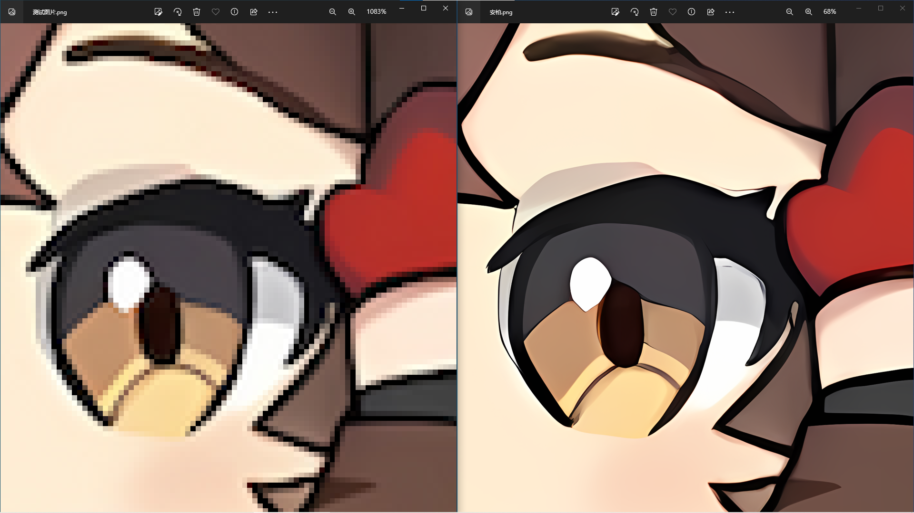

# 图像超分

## 描述

这是一个软件用来无损放大图片，支持多种图片和视频以及在线视频的无损放大

## 效果

## 优点

- 简单易用，简洁的界面，只要轻点几下就可以了实现图片无损放大
- 支持多种格式，可以处理图片、视频、甚至是在线视频
- 开源免费，永远不用担心他有一天会收费
- 十分轻量，1.67MB 的大小，却有着强大的功能
- 快如闪电，充分利用 GPU 和多线程，拥有极快的速度
- 十分安全，端侧计算，数据均在本地处理，保护用户隐私
- 功能强大，支持多种放大算法，无论应对什么样的图片都能完美处理

## 开发过程

使用多种技术，包括 Vite、Vue3、TypeScript、Rust、Tauri、HTML、CSS、Vue Router、Pinia、Gsap、PostCSS、TailwindCSS 等多达 12 门技术栈。使用 TypeScript 和 Rust 混合开发，充分保证其安全性、稳定性和可扩展性。并且使用最新人工智能深度学习技术——深度卷积神经网络。它会将噪点和锯齿的部分进行补充，实现图片的无损放大。针对放大图片的线条、颜色、网点等特点，做特殊的算法调整，所以放大效果非常出色，色彩保留较好，图片边缘也不会有毛刺和重影。更重要的是，影响画质的噪点基本在放大的图片上看不出来。

## 应用

- 在 AIGC 方面有重大应用，对 AI 绘画有着深远影响
- 对视频工作者、游戏工作者都有帮助
